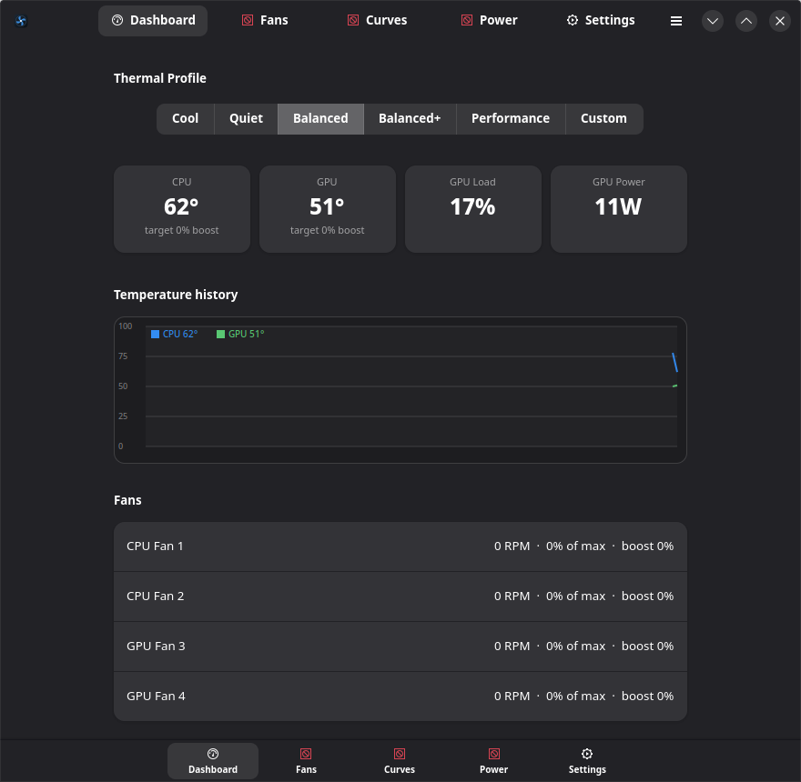
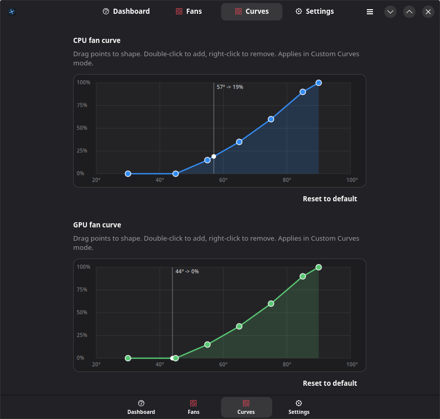

# AWCC-Linux

**Alienware Command Center–style thermal & fan control for Linux.**

A native Linux replacement for the thermal/fan features of Alienware Command
Center: live temperature & fan monitoring, one-click thermal profiles, manual
fan boost, and fully custom **fan curves** — driven by the mainline
`alienware-wmi` kernel driver.




---

## Features

- **Live dashboard** — CPU/GPU temperatures, GPU load & power, all fan RPMs, and
  a scrolling temperature history graph.
- **Thermal profiles** — switch between the firmware profiles exposed by your
  machine (`quiet`, `cool`, `balanced`, `balanced-performance`, `performance`,
  `custom`) with one click, straight to `/sys/firmware/acpi/platform_profile`.
- **Custom fan curves** — draggable temperature→boost curves for the CPU and GPU
  fan groups, evaluated continuously by the daemon. This is the AWCC headline
  feature that Linux otherwise lacks.
- **Manual fan boost** — pin the CPU/GPU fans to a fixed boost level.
- **System tray** — closing the window minimizes to the system tray
  (StatusNotifierItem, native on KDE Plasma). The tray shows live CPU/GPU temps
  on hover and offers quick thermal-profile and fan-mode switching plus Quit;
  left-click restores the window.
- **Live tray temperature** — optionally render the current CPU and/or GPU
  temperature right on the tray icon (colour-coded green/amber/red), so you can
  watch temps at a glance without opening anything. Drawn as an icon pixmap so
  it shows even on hosts that ignore the Ayatana label extension.
- **Start on login** — one toggle in Settings to autostart AWCC-Linux minimized
  to the tray (writes a standard `~/.config/autostart` entry).
- **Terminal client** — `awcc-cli` for scripting and headless use.
- **Safe by design** — fan control uses the driver's *additive* `fanN_boost`
  mechanism. Boost only ever *adds* cooling on top of the embedded controller's
  own curve; the EC keeps its thermal-safety floor, so a curve can't undercool
  the machine.

## How it works

```
  ┌────────────┐   Unix socket (JSON)   ┌──────────────────────────┐
  │  awcc GUI  │ ─────────────────────▶ │  awccd  (root daemon)     │
  │  awcc-cli  │ ◀───────────────────── │  • reads hwmon sensors    │
  └────────────┘   state stream         │  • runs fan-curve loop    │
                                        │  • writes platform_profile│
                                        │    and fanN_boost (sysfs) │
                                        └──────────────────────────┘
```

- **`awccd`** runs as a small root systemd service. It is the *only* component
  that writes to `/sys`. It polls sensors, applies the active mode, and serves a
  local Unix socket at `/run/awcc/awccd.sock` (owned `root:wheel`, mode `0660`).
- **`awcc`** (GTK4/libadwaita GUI) and **`awcc-cli`** connect to that socket.
  Because socket access is gated on the `wheel` group, control needs **no
  password after install** — the same trust boundary as `sudo`.
- Zero third-party Python dependencies for the daemon (stdlib only). The GUI
  uses system PyGObject (GTK4 + libadwaita).

## Supported hardware

Built and verified on an **Alienware m18 R1** (Intel i9-13980HX + RTX 4090
Laptop) running **Bazzite** (Fedora Atomic / KDE), kernel 6.19.

It should work on any Dell/Alienware laptop where the mainline **`alienware-wmi`**
driver exposes a `hwmon` device with `fanN_boost` attributes and the kernel
exposes `/sys/firmware/acpi/platform_profile`. Check with:

```bash
grep . /sys/class/hwmon/*/name | grep alienware_wmi
cat /sys/firmware/acpi/platform_profile_choices
```

If `fanN_boost` isn't present, profile switching and monitoring still work, but
custom curves / manual boost will be inert.

## Requirements

- Linux kernel with `alienware-wmi` (≥ 6.12 for the modern hwmon interface).
- `python3` (3.10+), `python3-gobject`, `gtk4`, `libadwaita`.
- `nvidia-smi` (optional) for discrete-GPU temperature/power.
- A `systemd` init.

On Bazzite / most desktop distros these are already present.

## Install

```bash
git clone https://github.com/32bitcolor/awcc-linux.git
cd awcc-linux
./packaging/install.sh        # prompts once for your password (pkexec/sudo)
```

This installs the app to `/opt/awcc`, enables and starts the `awccd` service,
and adds an **AWCC-Linux** entry to your app menu plus `awcc` / `awcc-cli` in
`$PATH`. Everything lands in writable locations, so it works on immutable
distros (Bazzite, Silverblue, Kinoite).

Launch from your app menu, or:

```bash
awcc            # GUI
awcc-cli status # terminal
```

### Uninstall

```bash
./packaging/uninstall.sh
```

## CLI usage

```bash
awcc-cli status                          # temps, fans, mode, profile
awcc-cli watch                           # live-updating status
awcc-cli profile performance             # set a firmware thermal profile
awcc-cli mode custom                     # follow the fan curves
awcc-cli boost gpu 80                    # manual: GPU fans to 80% boost
awcc-cli curve cpu                       # show the CPU fan curve
awcc-cli curve cpu 40:0 60:30 80:70 90:100   # set the CPU fan curve (temp:boost)
```

## Development

Run the daemon unprivileged (hardware writes become no-ops, everything else is
live) and point the clients at a throwaway socket:

```bash
export AWCCD_DEV=1
export AWCCD_RUN_DIR=/tmp/awcc AWCCD_STATE_DIR=/tmp/awcc
export AWCCD_SOCKET=$AWCCD_RUN_DIR/awccd.sock
mkdir -p $AWCCD_RUN_DIR
python3 -m awccd.main &
./awcc-cli status
./awcc
```

### Layout

| Path | Purpose |
|------|---------|
| `awccd/` | root daemon: `hardware.py` (sysfs/nvidia), `config.py` (curves), `engine.py` (control loop), `server.py` (socket), `main.py` |
| `awcc_client.py` | shared socket client |
| `awcc_gui/` | GTK4 GUI: `app.py`, `curve_editor.py`, `graph.py`, `backend.py` |
| `awcc`, `awcc-cli` | launchers |
| `packaging/` | systemd unit, `.desktop`, install/uninstall |

## Safety notes

- `fanN_boost` is **additive** and honoured by the firmware only in the `custom`
  platform profile; the daemon switches to `custom` automatically for curve and
  manual modes. Boost adds cooling; it cannot disable the EC's own protection.
- The daemon writes defensively — a single failed sysfs write is logged and
  skipped, never crashing the control loop.
- Nothing is exposed over the network; the only interface is a local,
  `wheel`-group Unix socket.

## Disclaimer

This is an independent project. It is **not** affiliated with, endorsed by, or
supported by Dell or Alienware. "Alienware" and "Alienware Command Center" are
trademarks of their respective owners. Use at your own risk.

## License

MIT — see [LICENSE](LICENSE).
